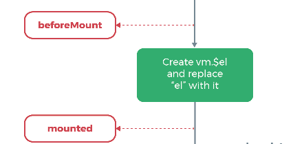

# vue-lifecycle
Vue生命周期


图片来源于vue官网

## vue生命周期钩子函数

## beforeCreate
此时el、data、method都还没有出事化，可以在此时添加loading一系列的工作。


## created
此时data、method完成了初始化，实例创建成功。但是el还没有定义，因此DOM节点并没有挂载，此时需要判断el是否存在，
* 存在：执行下一步；
* 不存在：调用vm.$mount创建一个默认节点，执行下一步。

此时因为DOM还没有渲染，可以进行数据的初始化、执行一些自执行的方法。
创建完挂载点之后，会判断vue实例中是否有template模板

* 有：直接渲染模板
* 没有：就直接编译挂载点outerHTML作为模板


## beforeMount、mounted

**beforeMount**编译模板，并且将虚拟的DOM节点挂载在el上。(此时模板中的插值语法还未替换，例如（```html<div>{{ msg }}</div>```)
**mounted**编译模板，并且将真实的DOM节点挂载在el上。(此时模板中的插值语法已经被完全替换替换，例如（```html<div>hello world</div>```)



## beforeUpdate、updated

**beforeUpdate**在数据有更新时，进入此钩子函数，虚拟DOM被重新创建
**updated**数据更新完成时，进入此钩子函数

